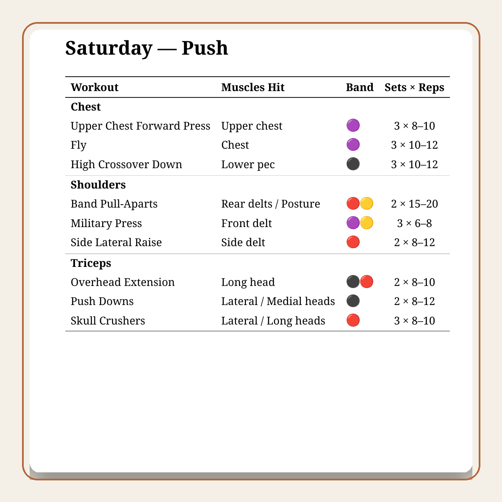
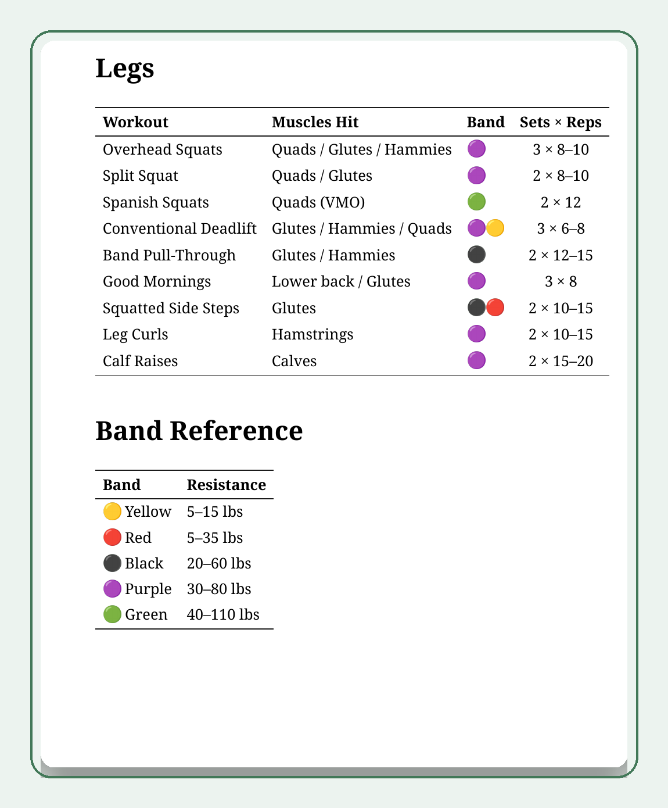

# Workout

Resistance band workout program — generates a printable PDF from Markdown.

## PDF Preview

Example tables from the generated PDF.

| Saturday Push | Legs + Band Reference |
|---|---|
|  |  |

## Usage

```
workout
```

Builds `workout.pdf` from `program.md` + `reference.md` and copies it to `~/Dropbox/`.

## Personalized Planning And Review

This repo includes the `workout-program-evaluation` skill in `.github/skills/workout-program-evaluation/`.

- Use the gitignored `.training-preferences.local.md` file as the personal questionnaire and constraint sheet for full program builds or revisions.
- The evaluation skill reads those local answers to tailor exercise choices, volume, rep structure, recovery tradeoffs, and session length without committing private preferences.
- The skill can also inspect `git log -p -- program.md` to track how the plan changes over time, identify areas that are improving or stagnating, and give targeted feedback on what to adjust next.

## Setup

```
ln -s "$(pwd)/workout" ~/bin/workout
```

## Files

- `program.md` — weekly training schedule (Pull / Push / Legs + micro sessions)
- `reference.md` — full exercise catalog and band reference
- `md2pdf` — Markdown → PDF converter (Pandoc + WeasyPrint)
- `workout` — build script (calls `md2pdf`, syncs to Dropbox)
